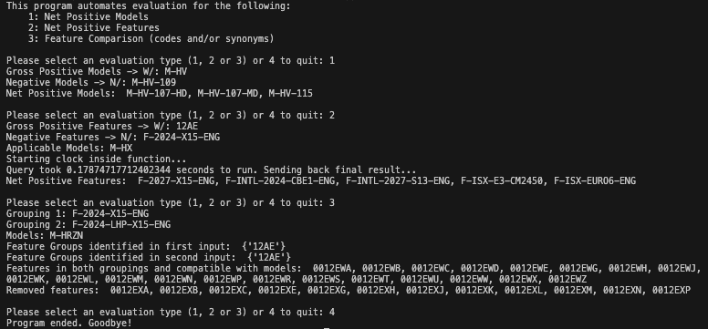

# Selection Rule Evaluator

This tool automates analysis of subtracting specified features or models from a provided gross positive to generate the net positive set of models or features. The primary motivation for creating this tool was to eliminate hours of manual research spread across multiple internal systems. Most feature queries (which are the most complex of the 3 evaluations) process in less than 1 second. When fresh data needs to be pulled from the database, roughly 5-10 seconds is added.

For feature evaluations, the net positive also evaluates against model/market compatibility records. Note: the net positive result may contain synonyms with member features that are not compatible with the specified models. These incompatibilities are checked via another process in the order coding system, so what we care about here is making sure that the net positive result does not add any compatible features that should not be there or miss any compatible features that should be there.

There are 3 types of evaluation:

- Model
- Feature
- Term/Token Comparison

For Model and Feature evaluations, the tool prompts for gross positive (W/) and negative (N/) inputs. Negative inputs are optional and are typically omitted only to check if a simplification of terms is available (for example, can multiple sub-terms be consolidated into a larger term).

For Feature evaluations, the tool also prompts for models. This is a required field and is used to determine compatibility of resulting net positive features. The results from feature evaluations are also exported to an Excel file that contains a sheet for the net positive result as well as a sheet with the original query. Each file name is intended to be unique by setting the filename with the date and time.

The Term/Token Comparison evaluation prompts for 2 groupings of feature codes plus models and then will specify (1) which terms are present in both groups and compatible with specified models and (2) which terms were not present in both groups and/or not compatible with specified models.

### Model and Feature Codes

Unique 7-character identifiers that correspond to vehicle families (ex: HV50700) or to physical parts on a vehicle, such as fuel tanks (ex: 0012ELT), brakes (ex: 0004092), etc.

### Synonyms

These are terms used to group similar features or models. Feature synonyms begin with 'F-' and model synonyms begin with 'M-'.

### Automatic Data Refresh

The tool was designed to automatically pull fresh data via a SQL query to the company's internal Hadoop database whenever the last-pull date was older than today. Since I no longer have access after leaving the company, today's date has been fixed as 2026-05-04. Please note that manually changing the 'last_run.txt' file that stores the last-run date will cause the data refresh to fail.

## Examples

Here is a simple example that demonstrates all 3 evaluation types. The program is designed to allow multiple different evaluations until the user stops the program by entering '4'.

